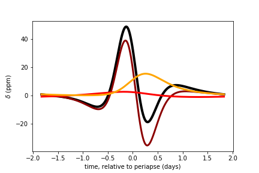

# OoT
Out-of-Transit Light Curve Generator

A lightweight python package for finding the light curves and radial velocity profiles of a star due to a planetary companion. It doesn't caulculate the effect of transits, but it does do everything else (orbital velocity, tidal distortion, relativistic beaming and reflections from the planetary surface, see Penoyre 2018 LINK).

You supply the parameters of the planetary system, and then can calculate the light curve/ radial velocity profile at a given time (or series of times).

For example:

importing the packages (you may want to add OoT to your PYTHONPATH)

    import oot
    import numpy as np
    import matplotlib.pyplot as plt
    
defining the planetary system (all masses are in solar masses, distances in solar radii, angles in radians)
    
    planet=oot.planet()
    planet.M=1 #sun-like star
    planet.R=1
    planet.Mp=0.001 #jupiter-like planet
    planet.Rp=0.1
    planet.a=10 #close eccentric orbit
    planet.e=0.5
    planet.vTheta=np.pi/3 #viewed from an oblique angle
    planet.vPhi=np.pi/3
    
create a series of timesteps at which to calculate light curve

    period=oot.findT(2*np.pi,planet)
    ts=np.linspace(-period/2,period/2,1000)

calculate the fractional change in luminosity (both as the sum of all effects and as individual effects)

    deltaSum=oot.deltaSum(ts,planet)
    deltaTide=oot.deltaTide(ts,planet)
    deltaBeam=oot.deltaBeam(ts,planet)
    deltaReflect=oot.deltaReflect(ts,planet)
    
plot these (in days and parts per million)

    deltaPlot=plt.gca()
    deltaPlot.plot(365*ts,1e6*deltaSum,c='k',lw=4)
    deltaPlot.plot(365*ts,1e6*deltaTide,c='darkred',lw=3)
    deltaPlot.plot(365*ts,1e6*deltaBeam,c='red',lw=3)
    deltaPlot.plot(365*ts,1e6*deltaReflect,c='orange',lw=3)
    
giving

